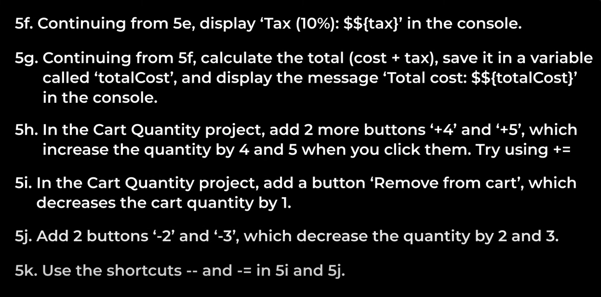
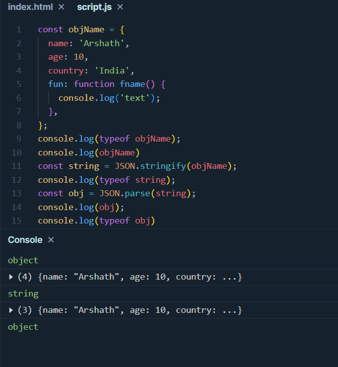
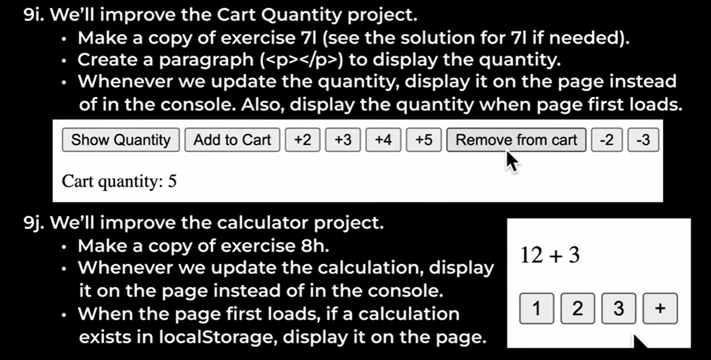
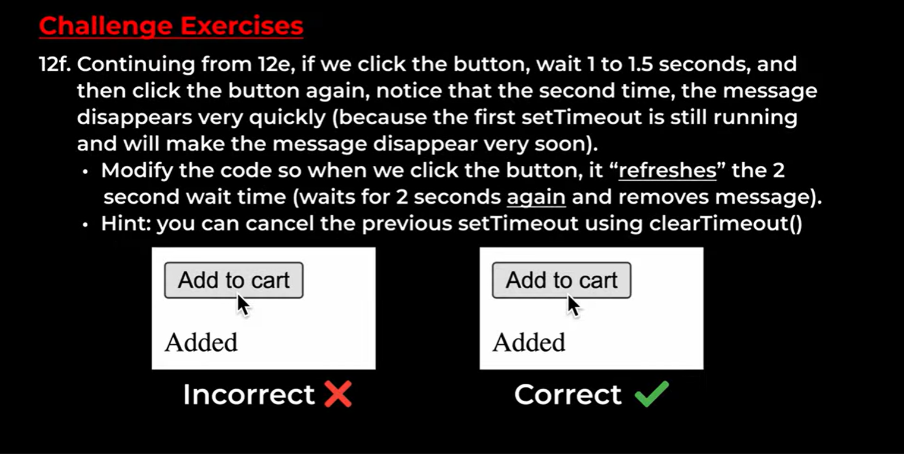

# Tasks
* To Practice - https://supersimple.dev/js-basics/
* Final Website - https://supersimple.dev/projects/amazon/
## Lesson - 1


* Note 2
```js
"allow pasting"
```
* 1a
```js
alert('Good morninng!');
```
* 1b
```js
alert('Arshath Ahamed')
```
* 1c,1d,1e
```js
10+5
20-5
2+2-5
```

* 1f , 1g
```js
document.body.innerHTML = "Good morning";
document.body.innerHTML = "Arshath Ahamed";
```
* 1h,1i,1j
```js
10 + 8 + 20 = 38
100 - 20 - 50 + 200 = 230
document.body.innerHTML = "";
```
## Lesson 2

* 2a , 2b ,2c ,2d ,2e
```js
1 * 10 + 3 * 8 + 1 * 5 == 39
3 *(1 * 10 + 3 * 8 + 1 * 5) == 117
18.50 + 2 * 7.50 == 33.5
(18.50 + 2 * 7.50) * 0.1 == 3.35
(18.50 + 2 * 7.50) * 0.2 == 6.7
```

* 2f , 2g ,2h, 2i
```js
(20.95 * 100 + 7.99 * 100 + 18.99 * 100) / 100 ; // 47.93
(20.95 * 100 + 7.99 * 100 + 18.99 * 100 + 4.99 * 100) / 100 ; // 52.92
Math.round((20.95 * 100 + 7.99 * 100 + 18.99 * 100 + 4.99 * 100) * 0.1) / 100; // 5.29
((20.95 * 100 + 7.99 * 100 + 18.99 * 100 + 4.99 * 100) / 100) + Math.round((20.95 * 100 + 7.99 * 100 + 18.99 * 100 + 4.99 * 100) * 0.1) / 100 // 58.21
```
## Lesson 3

* 3a
```js
'My name is:'
```
* 3b
```js
'Arshath'
```
* 3c
```js
'My name is: Arshath'
```
* 3d
```js
console.log(`Total cost: $8`);
```
* 3e
```js
console.log(`Total cost: $${5 + 3}`);
```
* 3f
```js
alert(`Total cost: $${5 + 3}`);
```

* 3g
```js
let coffee = 5.99;
let bagel = 2.95;
let result = (coffee * 100 + bagel * 100) / 100;
console.log('Total cost: $'+result);
```
* 3h
```js
let coffee = 5.99;
let bagel = 2.95;
console.log(`Total cost: $${(coffee * 100 + bagel * 100) / 100}`);
```
* 3i
```js
let coffee = 5.99;
let bagel = 2.95;
alert(`Total cost: $${(coffee * 100 + bagel * 100) / 100}`);
```
* 3j
```js
let coffee = 5.99;
let bagel = 2.95;
alert(`Total cost: $${(coffee * 100 + bagel * 100) / 100}
Thank you, come again!`);
```
 
* 3k
```js
`Items (${2 + 2}): $${(2 * 2095 + 2 * 799) / 100}`
```
* 3l
```js
`Shipping & handling: $${(4.99*100+4.99*100)/100}`
```
* 3m
```js
`Total before tax: $${(20.95*2*100+7.99*2*100+4.99*2*100)/100}`
```
* 3n
```js
`Extimated tax (10%): $${Math.round((20.95*2*100+7.99*2*100+4.99*2*100)*0.1)/100}`
```
## Lesson 4

* 4a
```html
<button>click</button>
```
* 4b
```html
<button>Arshath</button>
<button>Fried Rice</button>
```
* 4c
```html
<p>Hello, world!</p>
```
* 4d
```html
<p>Hello, world!</p>
<p>Today i dont a portfolio in a short period of time</p>
```

* 4e - 4h
```html
<!DOCTYPE html>
<html lang="en">
<head>
    <meta charset="UTF-8">
    <meta name="viewport" content="width=device-width, initial-scale=1.0">
    <title>Buttons</title>
</head>
<body>
    <button style="background-color:yellow">Add to cart</button>
    <button style="background-color:orange">Buy now</button>
    <script>console.log('Welcome!')</script>
</body>
</html>
```
## Lesson - 5 Variiables
https://supersimple.dev/projects/variables/

* 5a
```js
<script>
    name = "Arshath Ahamed";
<script>
```
* 5b
```js
<script>
    name = "Arshath Ahamed";
    console.log(`My name is: ${name}`)
<script>
```
* 5c
```js
<script>
    let coffee = 5;
    let bagels = 3;
    let soup = 9;
    let cost = coffee+bagels+bagels+soup;
<script>
```
* 5d
```js
<script>
    let coffee = 5;
    let bagels = 3;
    let soup = 9;
    let cost = coffee+bagels+bagels+soup;
    console.log(`Cost of food : $${cost}`)
<script>
```
* 5e
```js
<script>
    let coffee = 5;
    let bagels = 3;
    let soup = 9;
    let cost = coffee+bagels+bagels+soup;
    let tax = cost * 0.1;
<script>
```

* 5f
```js
<script>
    let coffee = 5;
    let bagels = 3;
    let soup = 9;
    let cost = coffee+bagels+bagels+soup;
    let tax = cost * 0.1;
    console.log(`Tax (10%): $${tax}`);
<script>
```
* 5g
```js
<script>
    let coffee = 5;
    let bagels = 3;
    let soup = 9;
    let cost = coffee+bagels+bagels+soup;
    let tax = cost * 0.1;
    let totalCost = cost + tax;
    console.log(`Total cost : $${totalCost}`);
<script>
```
* 5h
```js
<button onclick="
    cartQuantity += 4;
    print();
">+4</button>
<button onclick="
    cartQuantity += 5;
    print();
">+5</button>
```
* 5i
```js
<button onclick="
    cartQuantity--;
    print();
">Remove From Cart</button>
```
* 5j
```js
<button onclick="
    cartQuantity-=2;
    print();
">-2</button>
<button onclick="
    cartQuantity-=3;
    print();
">-3</button>
```
* 5k - I did already


https://supersimple.dev/projects/calculator/
* 5l,5m,5n
```html
<!DOCTYPE html>
<html lang="en">
<head>
    <title>Calculator</title>
</head>
<body>
    <button>1</button>
    <button>2</button>
    <button>3</button>
    <button>+</button>
    <button>=</button>
    <script>
        let calculation = ``;
    </script>
</body>
</html>
```

* 5n - 5r
```html
<!DOCTYPE html>
<html lang="en">
<head>
    <title>Calculator</title>
</head>
<body>
    <p>
        <button onclick="
            calculation += `1`;
            print();
        ">1</button>
        <button onclick="
            calculation += `2`;
            print();
        ">2</button>
        <button onclick="
            calculation += `3`;
            print();
        ">3</button>
        <button onclick="
            calculation += ` + `;
            print();
        ">+</button>
    </p>
    <p>
        <button onclick="
            calculation += `4`;
            print();
        ">4</button>
        <button onclick="
            calculation += `5`;
            print();
        ">5</button>
        <button onclick="
            calculation += `6`;
            print();
        ">6</button>
        <button onclick="
            calculation += ` - `;
            print();
        ">-</button>
    </p>
    <p>
        <button onclick="
            calculation += `7`;
            print();
        ">7</button>
        <button onclick="
            calculation += `8`;
            print();
        ">8</button>
        <button onclick="
            calculation += `9`;
            print();
        ">9</button>
        <button onclick="
            calculation += ` * `;
            print();
        ">*</button>
    </p>
    <p>
        <button onclick="
            calculation += `0`;
            print();
        ">0</button>
        <button onclick="
            calculation += `.`;
            print();
        ">.</button>
        <button onclick="
            calculation = eval(calculation);
            print();
        ">=</button>
        <button onclick="
            calculation += ` / `;
            print();
        ">/</button>
    </p>
    <p>
        <button onclick="
            calculation = ``;
        ">clear</button>
    </p>
    <script>
        let calculation = ``;
        let print = ()=>{
            console.log(calculation);
        }
    </script>
</body>
</html>
```
## Lesson - 6 Boolean and If Statements

* 6a , 6b
```js
let hour = 7 % 24;
if (hour >= 6 && hour <= 12) console.log('Good morning');
else if (hour >= 13 && hour <= 17) console.log('Good afternoon');
else console.log('Good night');
```
* 6c
```js
let hour = 17 % 24;
const name = 'Arshath Ahamed';
if (hour >= 6 && hour <= 12) console.log(`Good morning ${name}`);
else if (hour >= 13 && hour <= 17) console.log(`Good afternoon ${name}`);
else console.log(`Good night ${name}`);
```

* 6d
```js
let age = 6;
if(age <= 6 || age >= 65) console.log('Discount');
else console.log('No Discount')
```
* 6e
```js
let age = 6;
let isHoliday = false;
if (!isHoliday && (age <= 6 || age >= 65)) console.log('Discount');
else console.log('No Discount');
```

* 6f - 6j
```html
<!DOCTYPE html>
<html lang="en">
<head>
    <meta charset="UTF-8">
    <meta name="viewport" content="width=device-width, initial-scale=1.0">
    <title>Coin Flip</title>
</head>
<body>
    <script>
        let guess = 'head';
        let result = Math.random() > 0.5 ? "tail" : "head";
        console.log(guess === result ? "You win!" : "You lose!");
    </script>
</body>
</html>
```

* 6k,6l
```html
<html>
    <head>
        <title>
            Cart Quantity
        </title>
    </head>
    <body>
        <p>Cart Quantity</p>
        <button onclick="
            print();
        ">Show Quantity</button>
        <button onclick="
            if(cartQuantity+1 <= 10){
                cartQuantity = cartQuantity+1;
                print();
            }
            else full();
        ">Add to Cart</button>
        <button onclick="
            if(cartQuantity+2 <= 10){
                cartQuantity = cartQuantity+2;
                print();
            }
            else full();
        ">+2</button>
        <button onclick="
            if(cartQuantity+3 <= 10){
                cartQuantity = cartQuantity+3;
                print();
            }
            else full();
        ">+3</button>
        <button onclick="
            if(cartQuantity+4 <= 10){
                cartQuantity = cartQuantity+4;
                print();
            }
            else full();
        ">+4</button>
        <button onclick="
            if(cartQuantity+5 <= 10){
                cartQuantity = cartQuantity+5;
                print();
            }
            else full();
        ">+5</button>
        <button onclick="
            if(cartQuantity-1 >= 0){
                cartQuantity = cartQuantity-1;
                print();
            }
            else empty();
        ">Remove From Cart</button>
        <button onclick="
            if(cartQuantity-2 >= 0){
                cartQuantity = cartQuantity-2;
                print();
            }
            else empty();
        ">-2</button>
        <button onclick="
            if(cartQuantity-3 >= 0){
                cartQuantity = cartQuantity-3;
                print();
            }
            else empty();
        ">-3</button>
        <button onclick="
            reset();
        ">Reset Card</button>
        <script>
            let cartQuantity = 0;
            let print = () =>{
                console.log(`Cart Quantity : ${cartQuantity}`)
            }
            let reset = () =>{
                cartQuantity = 0;
                console.log("Cart was reset")
                print();
            }
            let empty = ()=>{
                alert("Not enough items in the cart");
            }
            let full = ()=>{
                alert("The cart is full");
            }
        </script>
    </body>
</html>
```

## Lesson - 7 Functions

* 7a
```js
function greet(){
  console.log("Hello!");
}
greet();
greet();
greet();
```
* 7b
```js
function greet(name){
  console.log(`Hello! ${name}`);
}
greet('Arshath');
greet('Asreen');
greet('Irshad');
```
* 7c
```js
function greet(name){
  if(!name) console.log('Hello there!');
  else console.log(`Hello! ${name}`);
}
greet(); // Hello there!
```

* 7d
```js
function convertToFahrenheit(celsius) {
  console.log((celsius * 9/ 5) + 32);
}
convertToFahrenheit(30);
```
* 7e
```js
function convertToCelcius(fahrenheit){
  console.log((fahrenheit - 32) * 5 / 9);
}
convertToCelcius(86);
```
* 7f
```js
function convertToFahrenheit(celsius) {
  console.log(`${(celsius * 9/ 5) + 32}F`);
}
function convertToCelcius(fahrenheit){
  console.log(`${(fahrenheit - 32) * 5 / 9}C`);
}
function convertTemperature(degree , unit){
  if(unit === 'C') convertToFahrenheit(degree);
  if(unit === 'F') convertToCelcius(degree);
}
convertTemperature(25,'C');
convertTemperature(86,'F');
```

* 7g
```js
function convertLength(length,from,to){
  if(from===to){
    console.log(`${length} ${to}`);
  }
  else{
    if(from === 'km') console.log(`${length / 1.6} ${to}`);
    if(from === 'miles') console.log(`${length * 1.6} ${to}`);
  }
}
convertLength(50,'miles','km');
convertLength(50,'km','km');
convertLength(32,'km','miles');
```
* 7h , 7i
```js
function convertLength(length,from,to){
  if(from===to){
    return (`${length} ${to}`);
  }
  else{
    if(from === 'km') {
      if(to === 'miles') return (`${length / 1.6} ${to}`);
      if(to === 'ft') return (`${length * 3281} ${to}`);
    }
    if(from === 'miles') {
      if(to === 'km') return (`${length * 1.6} ${to}`);
      if(to === 'ft') return (`${length * 5280} ${to}`);
    }
    if(from === 'ft') {
      if(to === 'km') return (`${length / 3281} ${to}`);
      if(to === 'miles') return (`${length / 5280} ${to}`);
    }
    return `invalid unit ${to}`
  }
}
console.log(convertLength(26400,'ft','miles'));
console.log(convertLength(26400,'lbs','lbs'));
```

* 7j 
```html
<!DOCTYPE html>
<html lang="en">
<head>
    <title>Calculator</title>
</head>
<body>
    <p>
        <button onclick="
            updateCalculation(`1`);
        ">1</button>
        <button onclick="
            updateCalculation(`2`)
        ">2</button>
        <button onclick="
            updateCalculation(`3`);
        ">3</button>
        <button onclick="
            updateCalculation(` + `);
        ">+</button>
    </p>
    <p>
        <button onclick="
            updateCalculation(`4`);
        ">4</button>
        <button onclick="
            updateCalculation(`5`);
        ">5</button>
        <button onclick="
            updateCalculation(`6`);
        ">6</button>
        <button onclick="
            updateCalculation(` - `);
        ">-</button>
    </p>
    <p>
        <button onclick="
            updateCalculation(`7`);
        ">7</button>
        <button onclick="
            updateCalculation(`8`);
        ">8</button>
        <button onclick="
            updateCalculation(`9`);
        ">9</button>
        <button onclick="
            updateCalculation(` * `);
        ">*</button>
    </p>
    <p>
        <button onclick="
            updateCalculation(`0`);
        ">0</button>
        <button onclick="
            updateCalculation(`.`);
        ">.</button>
        <button onclick="
            if(calculation) calculation = eval(calculation);
            console.log(calculation);
        ">=</button>
        <button onclick="
            updateCalculation(` / `);
        ">/</button>
    </p>
    <p>
        <button onclick="
            calculation = ``;
        ">clear</button>
    </p>
    <script>
        let calculation = ``;
        function updateCalculation(value){
            calculation += value;
            console.log(calculation);
        }
    </script>
</body>
</html>
```
* 7k , 7l
```html
<html>
    <head>
        <title>
            Cart Quantity
        </title>
    </head>
    <body>
        <p>Cart Quantity</p>
        <button onclick="
            print();
        ">Show Quantity</button>
        <button onclick="
            add(1);
        ">Add to Cart</button>
        <button onclick="
            add(2);
        ">+2</button>
        <button onclick="
            add(3);
        ">+3</button>
        <button onclick="
            add(4);
        ">+4</button>
        <button onclick="
            add(5);
        ">+5</button>
        <button onclick="
            sub(1);
        ">Remove From Cart</button>
        <button onclick="
            sub(2);
        ">-2</button>
        <button onclick="
            sub(3);
        ">-3</button>
        <button onclick="
            reset();
        ">Reset Card</button>
        <script>
            let cartQuantity = 0;
            let print = () =>{
                console.log(`Cart Quantity : ${cartQuantity}`)
            }
            let sub = (val)=>{
                if(cartQuantity-val < 0){
                    empty();
                    return;
                }
                cartQuantity = cartQuantity-val;
                print();
            }
            let add = (val)=>{
                if(cartQuantity+val > 10){
                    empty();
                    return;
                }
                cartQuantity = cartQuantity+val;
                print();
            }
            let reset = () =>{
                cartQuantity = 0;
                console.log("Cart was reset")
                print();
            }
            let empty = ()=>{
                alert("Not enough items in the cart");
            }
            let full = ()=>{
                alert("The cart is full");
            }
        </script>
    </body>
</html>
```
## Lesson - 8 Object


* 8a
```js
const product = {
  name : "basketball",
  price : 2095
}
console.log(product)
```
* 8b
```js
const product = {
  name : "basketball",
  price : 2095
}
console.log(product)
product.price += 500;
console.log(product)
```
* 8c
```js
const product = {
  name: 'basketball',
  price: 2095,
};
console.log(product);
product.price += 500;
console.log(product);
product['delivery-time'] = '3 days';
console.log(product);
```
* 8d
```js
const product = {
  name: 'basketball',
  price: 2095,
};
const product2 = {
  name: 'cricket-bat',
  price: 1095,
};
function comparePrice(product1, product2) {
  return product1.price < product2.price ? product1 : product2;
}
console.log(comparePrice(product,product2));
```

* 8e
```js
const product = {
  name: 'basketball',
  price: 2095,
};
const product2 = {
  name: 'basketball',
  price: 2095,
};
function isSameProduct(product1, product2) {
  return product1.name === product2.name && product1.price === product2.price;
}
console.log(isSameProduct(product, product2));
```
* 8f
```js
let input = 'Good Morning';
console.log(input.toLowerCase());
```
* 8g
```js
let input = 'test';
console.log(input.repeat(3));
```
* 8h
```html
<!DOCTYPE html>
<html lang="en">
<head>
    <title>Calculator</title>
</head>
<body>
    <p>
        <button onclick="
            updateCalculation(`1`);
        ">1</button>
        <button onclick="
            updateCalculation(`2`)
        ">2</button>
        <button onclick="
            updateCalculation(`3`);
        ">3</button>
        <button onclick="
            updateCalculation(` + `);
        ">+</button>
    </p>
    <p>
        <button onclick="
            updateCalculation(`4`);
        ">4</button>
        <button onclick="
            updateCalculation(`5`);
        ">5</button>
        <button onclick="
            updateCalculation(`6`);
        ">6</button>
        <button onclick="
            updateCalculation(` - `);
        ">-</button>
    </p>
    <p>
        <button onclick="
            updateCalculation(`7`);
        ">7</button>
        <button onclick="
            updateCalculation(`8`);
        ">8</button>
        <button onclick="
            updateCalculation(`9`);
        ">9</button>
        <button onclick="
            updateCalculation(` * `);
        ">*</button>
    </p>
    <p>
        <button onclick="
            updateCalculation(`0`);
        ">0</button>
        <button onclick="
            updateCalculation(`.`);
        ">.</button>
        <button onclick="
            if(calculation) calculation = eval(calculation);
            console.log(calculation);
            save();
        ">=</button>
        <button onclick="
            updateCalculation(` / `);
        ">/</button>
    </p>
    <p>
        <button onclick="
            calculation = ``;
            save();
        ">clear</button>
    </p>
    <script>
        let calculation = localStorage.getItem('calculate') || ``;
        if(calculation) console.log(calculation);
        function updateCalculation(value){
            calculation += value;
            console.log(calculation);
            save();
        }
        function save(){
            localStorage.setItem('calculate',calculation);
        }
    </script>
</body>
</html>
```

* 8i
```html
<!DOCTYPE html>
<html lang="en">
<head>
    <meta charset="UTF-8">
    <meta name="viewport" content="width=device-width, initial-scale=1.0">
    <title>Coin Flip</title>
</head>
<body>
    <button onclick="play('head')">heads</button>
    <button onclick="play('tail')">tails</button>
    <script>
        function play(guess){
            let result = Math.random() > 0.5 ? "tail" : "head";
            console.log(guess === result ? "You win!" : "You lose!");
        }
    </script>
</body>
</html>
```
* 8k
```html
<!DOCTYPE html>
<html lang="en">
<head>
    <meta charset="UTF-8">
    <meta name="viewport" content="width=device-width, initial-scale=1.0">
    <title>Coin Flip</title>
</head>
<body>
    <button onclick="play('head')">heads</button>
    <button onclick="play('tail')">tails</button>
    <script>
        const score = JSON.parse(localStorage.getItem('score'))  || {
            wins:0,
            losses : 0
        };
        console.log(typeof score);
        function play(guess){
            let result = Math.random() > 0.5 ? "tail" : "head";
            console.log(guess === result ? "You win!" : "You lose!");
            if(guess === result) {
                score.wins++;
                
            }
            else score.losses++;
            console.log(score);
            localStorage.setItem('score',JSON.stringify(score));
        }
    </script>
</body>
</html>
```
## Lesson - 9 Document Object Model
https://supersimple.dev/projects/dom/

* 9a
```html
<button>9a</button>
<script>
    const button = document.querySelector('button');
    console.log(button);
</script>
```
* 9b
```html
<button>9a</button>
<button class="second">9b</button>
<script>
    const button = document.querySelector('button');
    document.querySelector('.second').innerHTML = '9b done';
</script>
```
* 9c
```html
<button onclick="display('heads')">heads</button>
<button onclick="display('tails')">tails</button>
<p class="js-show"></p>
<script>
    const word = document.querySelector('.js-show');
    function display(toss){
        word.innerHTML = `You chose: ${toss}`;
    }
</script>
```

* 9d
```html
<input placeholder="Name" class="js-input" type="text">
<button onclick="display()">Submit</button>
<p class="js-show"></p>
<script>
    const inputElement = document.querySelector('.js-input');
    const word = document.querySelector('.js-show');
    function display(){
        word.innerHTML = `Your name is: ${inputElement.value}`;
    }
</script>
```
* 9e
```html
<input placeholder="Name" class="js-input" onkeydown="displayOnKey(event)" type="text">
<button onclick="display()">Submit</button>
<p class="js-show"></p>
<script>
    const inputElement = document.querySelector('.js-input');
    const word = document.querySelector('.js-show');
    function displayOnKey(event){
        if(event.key === 'Enter') display();
    }
    function display(){
        word.innerHTML = `Your name is: ${inputElement.value}`;
        inputElement.value = '';
    }
</script>
```

* 9g
```js
if(cost < 40) cost += 10; // from 09-dom.html
// The above line is  converted as
if(cost < 40) cost = ((cost * 100) + 1000) / 100;
```
* 9h
```html
<!DOCTYPE html>
<html lang="en">
<head></head>
<body>
    <input placeholder="Type something" class="js-input" onkeyup="
        const inputElement = document.querySelector('.js-input');
        document.querySelector('.js-show').innerHTML = inputElement.value;
    ">
    <p class="js-show"></p>
</body>
</html>
```

* 9i
```html
<html>
    <head>
        <title>
            Cart Quantity
        </title>
    </head>
    <body>
        <p>Cart Quantity</p>
        <button onclick="
            print();
        ">Show Quantity</button>
        <button onclick="
            add(1);
        ">Add to Cart</button>
        <button onclick="
            add(2);
        ">+2</button>
        <button onclick="
            add(3);
        ">+3</button>
        <button onclick="
            add(4);
        ">+4</button>
        <button onclick="
            add(5);
        ">+5</button>
        <button onclick="
            add(-1);
        ">Remove From Cart</button>
        <button onclick="
            add(-2);
        ">-2</button>
        <button onclick="
            add(-3);
        ">-3</button>
        <button onclick="
            reset();
        ">Reset Card</button>
        <p class="js-show"></p>
        <script>
            const showElement = document.querySelector('.js-show');
            let cartQuantity = 0;
            print();
            function print(){
                showElement.innerHTML = `Cart Quantity : ${cartQuantity}`;
            }
            let add = (val)=>{
                if(cartQuantity+val > 10){
                    full();
                    return;
                }
                if(cartQuantity+val < 0){
                    empty();
                    return;
                }
                cartQuantity = cartQuantity+val;
                print();
            }
            let reset = () =>{
                cartQuantity = 0;
                console.log("Cart was reset")
                print();
            }
            let empty = ()=>{
                alert("Not enough items in the cart");
            }
            let full = ()=>{
                alert("The cart is full");
            }
        </script>
    </body>
</html>
```
* 9j
```html
<!DOCTYPE html>
<html lang="en">
<head>
    <title>Calculator</title>
</head>
<body>
    <p class="js-show"></p>
    <p>
        <button onclick="
            updateCalculation(`1`);
        ">1</button>
        <button onclick="
            updateCalculation(`2`)
        ">2</button>
        <button onclick="
            updateCalculation(`3`);
        ">3</button>
        <button onclick="
            updateCalculation(` + `);
        ">+</button>
    </p>
    <p>
        <button onclick="
            updateCalculation(`4`);
        ">4</button>
        <button onclick="
            updateCalculation(`5`);
        ">5</button>
        <button onclick="
            updateCalculation(`6`);
        ">6</button>
        <button onclick="
            updateCalculation(` - `);
        ">-</button>
    </p>
    <p>
        <button onclick="
            updateCalculation(`7`);
        ">7</button>
        <button onclick="
            updateCalculation(`8`);
        ">8</button>
        <button onclick="
            updateCalculation(`9`);
        ">9</button>
        <button onclick="
            updateCalculation(` * `);
        ">*</button>
    </p>
    <p>
        <button onclick="
            updateCalculation(`0`);
        ">0</button>
        <button onclick="
            updateCalculation(`.`);
        ">.</button>
        <button onclick="
            if(calculation) calculation = eval(calculation);
            showElement.innerHTML = calculation;
            save();
        ">=</button>
        <button onclick="
            updateCalculation(` / `);
        ">/</button>
    </p>
    <p>
        <button onclick="
            calculation = ``;
            showElement.innerHTML = calculation;
            save();
        ">clear</button>
    </p>
    <script>
        const showElement = document.querySelector('.js-show');
        let calculation = localStorage.getItem('calculate') || ``;
        if(calculation) console.log(calculation);
        function updateCalculation(value){
            calculation += value;
            showElement.innerHTML = calculation;
            save();
        }
        function save(){
            localStorage.setItem('calculate',calculation);
        }
    </script>
</body>
</html>
```
## Lesson 10 - HTML , CSS , JS Together
https://supersimple.dev/projects/dom-with-css/

* 10a
```html
<!DOCTYPE html>
<html lang="en">
<head>
    <style>
        button{
            padding:5px 40px;
            border: none;
            cursor: pointer;
            background-color: rgb(255,216,20);
            border-radius: 30px;
        }
    </style>
</head>
<body>
    <button>Add to Cart</button>
</body>
</html>
```
* 10b
```html
<!DOCTYPE html>
<html lang="en">
<head>
    <style>
        button{
            padding:10px 15px;
            border: none;
            cursor: pointer;
            background-color: #000;
            color:#fff;
            border-radius: 3px;
            font-weight: bold;
        }
        .schedule-button{
            background-color: rgb(230,230,230);
            color:#000;
            margin-left: 20px;
        }
    </style>
</head>
<body>
    <button>Request now</button>
    <button class="schedule-button">Schedule for later</button>
</body>
</html>
```
* 10c
```html
<button class="js-button">Test</button>
<script>
    buttonElement = document.querySelector('button');
    console.log(buttonElement.classList.contains('js-button'));
</script>
```

* 10d
```html
<!DOCTYPE html>
<html lang="en">
<head>
    <style>
        button{
            padding:10px 15px;
            border: none;
            cursor: pointer;
            border-radius: 3px;
            font-weight: bold;
        }
        .active{
            background-color: #000;
            color:#fff;
        }
    </style>
</head>
<body>
    <button onclick="toggle()">Gaming</button>
    <script>
        const buttonElement = document.querySelector('button');
        function toggle(){
            if(buttonElement.classList.contains('active')){
                buttonElement.classList.remove('active');
            }
            else{
                buttonElement.classList.add('active');
            }
        }
    </script>
</body>
</html>
```
* 10e , 10f
```html
<!DOCTYPE html>
<html lang="en">
<head>
    <style>
        button{
            padding:10px 15px;
            border: none;
            cursor: pointer;
            border-radius: 3px;
            font-weight: bold;
        }
        .active{
            background-color: #000;
            color:#fff;
        }
    </style>
</head>
<body>
    <button onclick="toggle('.js-button')" class="js-button">Gaming</button>
    <button onclick="toggle('.js-button2')" class="js-button2">Music</button>
    <button onclick="toggle('.js-button3')" class="js-button3">Tech</button>
    <script>
        function toggle(selector){
            let buttonElement = document.querySelector(selector);
            if(buttonElement.classList.contains('active')){
                buttonElement.classList.remove('active');
            }
            else{
                buttonElement.classList.add('active');
            }
        }
    </script>
</body>
</html>
```

* 10g
### My answer (Not a correct answer)
```html
<button onclick="toggle('.js-button')" class="js-button">Gaming</button>
<button onclick="toggle('.js-button2')" class="js-button2">Music</button>
<button onclick="toggle('.js-button3')" class="js-button3">Tech</button>
<script>
    let active = 0;
    function toggle(selector){
        let buttonElement = document.querySelector(selector);
        if(buttonElement.classList.contains('active')){
            buttonElement.classList.remove('active');
            active--;
        }
        else{
            if(active <= 0){
                active++;
                buttonElement.classList.add('active');
            }
        }
    }
</script>
```
### Actual Answer
```html
<button onclick="toggle('.js-button')" class="js-button">Gaming</button>
<button onclick="toggle('.js-button2')" class="js-button2">Music</button>
<button onclick="toggle('.js-button3')" class="js-button3">Tech</button>
<script>
    function toggle(selector){
        let buttonElement = document.querySelector(selector);
        if(buttonElement.classList.contains('active')){
            buttonElement.classList.remove('active');
        }
        else{
            turnOffPreviousButton();
            buttonElement.classList.add('active');
        }
    }
    function turnOffPreviousButton() {
        const previousButton = document.querySelector('.active');
        if (previousButton) {
            previousButton.classList.remove('active');
        }
    }
</script>
```
* 10h
```html
<!DOCTYPE html>
<html lang="en">
<head>
    <title>DOM</title>
    <style>
        body{
            font-family: Arial, Helvetica, sans-serif;
        }
        .calculate-button{
            padding:12px 15px;
            border:none;
            background-color: rgb(0, 128, 0);
            color:#fff; 
            font-size: 15px;
            cursor: pointer;
        }
        .input-box{
            padding:10px;
            font-size: 15px;
        }
        .error{
            color:darkred;
        }
    </style>
</head>
<body>
    <p>Amazon Shipping Calculator</p>
    <p>Orders under $40 = +$10 shipping.</p>
    <p>Orders over $40 = FREE shipping.</p>
    <input class="js-input input-box" type="text" placeholder="Cost of order" onkeydown="handleCostKeydown(event)">
    <button onclick="calculateTotal()" class="calculate-button">Calculate</button>
    <p class="js-total"></p>
    <p class="js-error error"></p>
    <script>
        const totalElement = document.querySelector('.js-total');
        const errorElement = document.querySelector('.js-error');
        let handleCostKeydown = (event) => {
            if(event.code === 'Enter') calculateTotal();
        };
        
        let calculateTotal = () =>{
            errorElement.innerHTML = '';
            const inputElement = document.querySelector(".js-input");
            let cost = Number(inputElement.value);
            if(cost < 0){
                totalElement.innerHTML = '';
                errorElement.innerHTML = 'Error: cost cannot be less than $0';
            }
            else{
                if(cost < 40) cost += 10;
                totalElement.innerHTML = `$${cost}`;
            }
        };
    </script>
</body>
</html>
```

https://www.supersimple.dev/projects/calculator-final
* 10i , 10j
```html
<!DOCTYPE html>
<html lang="en">
<head>
    <title>Calculator</title>
    <style>
        body{
            background-color: #000;
            font-family: Arial, Helvetica, sans-serif;
        }
        button{
            width: 60px;
            height: 60px;
            background-color: rgb(51, 51, 51);
            font-size: 26px;
            cursor: pointer;
            border : none;
            border-radius: 50%;
            color: #fff;
            margin-right: 5.5px;
        }
        .operators{
            background-color: rgb(254, 160, 10);
        }
        .show{
            font-size: 45px;
            color:#fff;
            margin-top: 15px;
            margin-bottom: 15px;
        }
    </style>
</head>
<body>
    <p class="js-show show"></p>
    <p>
        <button onclick="
            updateCalculation(`1`);
        ">1</button>
        <button onclick="
            updateCalculation(`2`)
        ">2</button>
        <button onclick="
            updateCalculation(`3`);
        ">3</button>
        <button class="operators" onclick="
            updateCalculation(` + `);
        ">+</button>
    </p>
    <p>
        <button onclick="
            updateCalculation(`4`);
        ">4</button>
        <button onclick="
            updateCalculation(`5`);
        ">5</button>
        <button onclick="
            updateCalculation(`6`);
        ">6</button>
        <button class="operators" onclick="
            updateCalculation(` - `);
        ">-</button>
    </p>
    <p>
        <button onclick="
            updateCalculation(`7`);
        ">7</button>
        <button onclick="
            updateCalculation(`8`);
        ">8</button>
        <button onclick="
            updateCalculation(`9`);
        ">9</button>
        <button class="operators" onclick="
            updateCalculation(` * `);
        ">*</button>
    </p>
    <p>
        <button onclick="
            updateCalculation(`0`);
        ">0</button>
        <button onclick="
            updateCalculation(`.`);
        ">.</button>
        <button onclick="
            if(calculation) calculation = eval(calculation);
            showElement.innerHTML = calculation;
            save();
        ">=</button>
        <button class="operators" onclick="
            updateCalculation(` / `);
        ">/</button>
    </p>
    <p>
        <button onclick="
            calculation = ``;
            showElement.innerHTML = calculation;
            save();
        " style="font-size:17px">Clear</button>
    </p>
    <script>
        const showElement = document.querySelector('.js-show');
        let calculation = localStorage.getItem('calculate') || ``;
        if(calculation) showElement.innerHTML = calculation;
        function updateCalculation(value){
            calculation += value;
            showElement.innerHTML = calculation;
            save();
        }
        function save(){
            localStorage.setItem('calculate',calculation);
        }
    </script>
</body>
</html>
```
## Lesson 11 Arrays and Loops
https://supersimple.dev/projects/arrays/


## Lesson 12 - Advanced Functions
https://www.supersimple.dev/projects/advanced-functions 





## Lesson 13 - Amazon Project
https://www.supersimple.dev/projects/amazon/