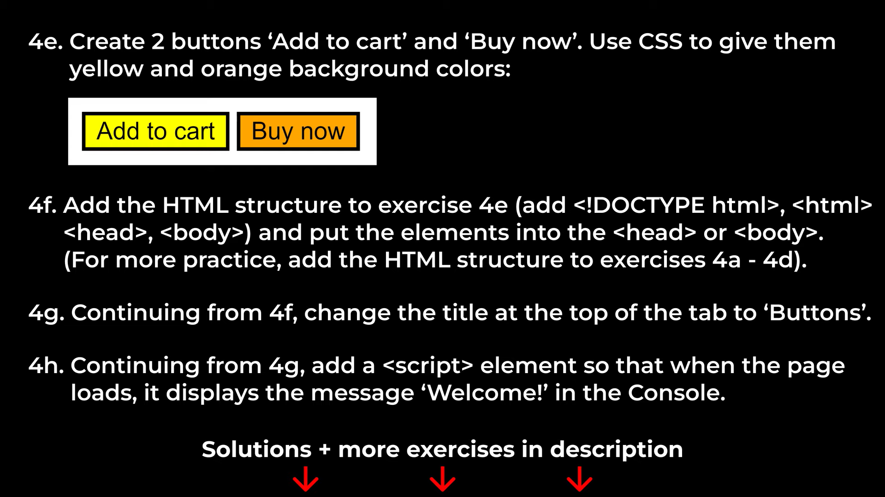
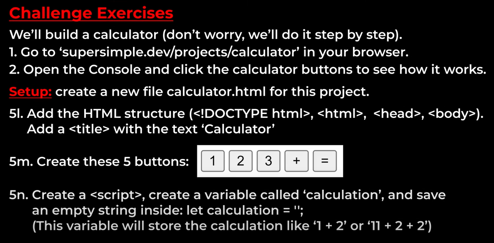

# Tasks
* To Practice - https://supersimple.dev/js-basics/
* Final Website - https://supersimple.dev/projects/amazon/
## Lesson - 1


* Note 2
```js
"allow pasting"
```
* 1a
```js
alert('Good morninng!');
```
* 1b
```js
alert('Arshath Ahamed')
```
* 1c,1d,1e
```js
10+5
20-5
2+2-5
```

* 1f , 1g
```js
document.body.innerHTML = "Good morning";
document.body.innerHTML = "Arshath Ahamed";
```
* 1h,1i,1j
```js
10 + 8 + 20 = 38
100 - 20 - 50 + 200 = 230
document.body.innerHTML = "";
```
## Lesson 2


* 2a , 2b ,2c ,2d ,2e
```js
1 * 10 + 3 * 8 + 1 * 5 == 39
3 *(1 * 10 + 3 * 8 + 1 * 5) == 117
18.50 + 2 * 7.50 == 33.5
(18.50 + 2 * 7.50) * 0.1 == 3.35
(18.50 + 2 * 7.50) * 0.2 == 6.7
```
* 2f , 2g ,2h, 2i
```js
(20.95 * 100 + 7.99 * 100 + 18.99 * 100) / 100 ; // 47.93
(20.95 * 100 + 7.99 * 100 + 18.99 * 100 + 4.99 * 100) / 100 ; // 52.92
Math.round((20.95 * 100 + 7.99 * 100 + 18.99 * 100 + 4.99 * 100) * 0.1) / 100; // 5.29
((20.95 * 100 + 7.99 * 100 + 18.99 * 100 + 4.99 * 100) / 100) + Math.round((20.95 * 100 + 7.99 * 100 + 18.99 * 100 + 4.99 * 100) * 0.1) / 100 // 58.21
```
## Lesson 3


 
* 3a
```js
'My name is:'
```
* 3b
```js
'Arshath'
```
* 3c
```js
'My name is: Arshath'
```
* 3d
```js
console.log(`Total cost: $8`);
```
* 3e
```js
console.log(`Total cost: $${5 + 3}`);
```
* 3f
```js
alert(`Total cost: $${5 + 3}`);
```
* 3g
```js
let coffee = 5.99;
let bagel = 2.95;
let result = (coffee * 100 + bagel * 100) / 100;
console.log('Total cost: $'+result);
```
* 3h
```js
let coffee = 5.99;
let bagel = 2.95;
console.log(`Total cost: $${(coffee * 100 + bagel * 100) / 100}`);
```
* 3i
```js
let coffee = 5.99;
let bagel = 2.95;
alert(`Total cost: $${(coffee * 100 + bagel * 100) / 100}`);
```
* 3j
```js
let coffee = 5.99;
let bagel = 2.95;
alert(`Total cost: $${(coffee * 100 + bagel * 100) / 100}
Thank you, come again!`);
```
* 3k
```js
`Items (${2 + 2}): $${(2 * 2095 + 2 * 799) / 100}`
```
* 3l
```js
`Shipping & handling: $${(4.99*100+4.99*100)/100}`
```
* 3m
```js
`Total before tax: $${(20.95*2*100+7.99*2*100+4.99*2*100)/100}`
```
* 3n
```js
`Extimated tax (10%): $${Math.round((20.95*2*100+7.99*2*100+4.99*2*100)*0.1)/100}`
```
## Lesson 4


* 4a
```html
<button>click</button>
```
* 4b
```html
<button>Arshath</button>
<button>Fried Rice</button>
```
* 4c
```html
<p>Hello, world!</p>
```
* 4d
```html
<p>Hello, world!</p>
<p>Today i dont a portfolio in a short period of time</p>
```
* 4e - 4h
```html
<!DOCTYPE html>
<html lang="en">
<head>
    <meta charset="UTF-8">
    <meta name="viewport" content="width=device-width, initial-scale=1.0">
    <title>Buttons</title>
</head>
<body>
    <button style="background-color:yellow">Add to cart</button>
    <button style="background-color:orange">Buy now</button>
    <script>console.log('Welcome!')</script>
</body>
</html>
```
## Lesson - 5 Variiables
https://supersimple.dev/projects/variables/




* 5a
```js
<script>
    name = "Arshath Ahamed";
<script>
```
* 5b
```js
<script>
    name = "Arshath Ahamed";
    console.log(`My name is: ${name}`)
<script>
```
* 5c
```js
<script>
    let coffee = 5;
    let bagels = 3;
    let soup = 9;
    let cost = coffee+bagels+bagels+soup;
<script>
```
* 5d
```js
<script>
    let coffee = 5;
    let bagels = 3;
    let soup = 9;
    let cost = coffee+bagels+bagels+soup;
    console.log(`Cost of food : $${cost}`)
<script>
```
* 5e
```js
<script>
    let coffee = 5;
    let bagels = 3;
    let soup = 9;
    let cost = coffee+bagels+bagels+soup;
    let tax = cost * 0.1;
<script>
```
* 5f
```js
<script>
    let coffee = 5;
    let bagels = 3;
    let soup = 9;
    let cost = coffee+bagels+bagels+soup;
    let tax = cost * 0.1;
    console.log(`Tax (10%): $${tax}`);
<script>
```
* 5g
```js
<script>
    let coffee = 5;
    let bagels = 3;
    let soup = 9;
    let cost = coffee+bagels+bagels+soup;
    let tax = cost * 0.1;
    let totalCost = cost + tax;
    console.log(`Total cost : $${totalCost}`);
<script>
```
* 5h
```js
<button onclick="
    cartQuantity += 4;
    print();
">+4</button>
<button onclick="
    cartQuantity += 5;
    print();
">+5</button>
```
* 5i
```js
<button onclick="
    cartQuantity--;
    print();
">Remove From Cart</button>
```
* 5j
```js
<button onclick="
    cartQuantity-=2;
    print();
">-2</button>
<button onclick="
    cartQuantity-=3;
    print();
">-3</button>
```
* 5k - I did already
https://supersimple.dev/projects/calculator/
* 5l,5m,5n
```html
<!DOCTYPE html>
<html lang="en">
<head>
    <title>Calculator</title>
</head>
<body>
    <button>1</button>
    <button>2</button>
    <button>3</button>
    <button>+</button>
    <button>=</button>
    <script>
        let calculation = ``;
    </script>
</body>
</html>
```
* 5n - 5r
```html
<!DOCTYPE html>
<html lang="en">
<head>
    <title>Calculator</title>
</head>
<body>
    <p>
        <button onclick="
            calculation += `1`;
            print();
        ">1</button>
        <button onclick="
            calculation += `2`;
            print();
        ">2</button>
        <button onclick="
            calculation += `3`;
            print();
        ">3</button>
        <button onclick="
            calculation += ` + `;
            print();
        ">+</button>
    </p>
    <p>
        <button onclick="
            calculation += `4`;
            print();
        ">4</button>
        <button onclick="
            calculation += `5`;
            print();
        ">5</button>
        <button onclick="
            calculation += `6`;
            print();
        ">6</button>
        <button onclick="
            calculation += ` - `;
            print();
        ">-</button>
    </p>
    <p>
        <button onclick="
            calculation += `7`;
            print();
        ">7</button>
        <button onclick="
            calculation += `8`;
            print();
        ">8</button>
        <button onclick="
            calculation += `9`;
            print();
        ">9</button>
        <button onclick="
            calculation += ` * `;
            print();
        ">*</button>
    </p>
    <p>
        <button onclick="
            calculation += `0`;
            print();
        ">0</button>
        <button onclick="
            calculation += `.`;
            print();
        ">.</button>
        <button onclick="
            calculation = eval(calculation);
            print();
        ">=</button>
        <button onclick="
            calculation += ` / `;
            print();
        ">/</button>
    </p>
    <p>
        <button onclick="
            calculation = ``;
        ">clear</button>
    </p>
    <script>
        let calculation = ``;
        let print = ()=>{
            console.log(calculation);
        }
    </script>
</body>
</html>
```
## Lesson - 6 Boolean and If Statements


* 6a , 6b
```js
let hour = 7 % 24;
if (hour >= 6 && hour <= 12) console.log('Good morning');
else if (hour >= 13 && hour <= 17) console.log('Good afternoon');
else console.log('Good night');
```
* 6c
```js
let hour = 17 % 24;
const name = 'Arshath Ahamed';
if (hour >= 6 && hour <= 12) console.log(`Good morning ${name}`);
else if (hour >= 13 && hour <= 17) console.log(`Good afternoon ${name}`);
else console.log(`Good night ${name}`);
```
* 6d
```js
let age = 6;
if(age <= 6 || age >= 65) console.log('Discount');
else console.log('No Discount')
```
* 6e
```js
let age = 6;
let isHoliday = false;
if (!isHoliday && (age <= 6 || age >= 65)) console.log('Discount');
else console.log('No Discount');
```
* 6f - 6j
```html
<!DOCTYPE html>
<html lang="en">
<head>
    <meta charset="UTF-8">
    <meta name="viewport" content="width=device-width, initial-scale=1.0">
    <title>Coin Flip</title>
</head>
<body>
    <script>
        let guess = 'head';
        let result = Math.random() > 0.5 ? "tail" : "head";
        console.log(guess === result ? "You win!" : "You lose!");
    </script>
</body>
</html>
```
* 6k,6l
```html
<html>
    <head>
        <title>
            Cart Quantity
        </title>
    </head>
    <body>
        <p>Cart Quantity</p>
        <button onclick="
            print();
        ">Show Quantity</button>
        <button onclick="
            if(cartQuantity+1 <= 10){
                cartQuantity = cartQuantity+1;
                print();
            }
            else full();
        ">Add to Cart</button>
        <button onclick="
            if(cartQuantity+2 <= 10){
                cartQuantity = cartQuantity+2;
                print();
            }
            else full();
        ">+2</button>
        <button onclick="
            if(cartQuantity+3 <= 10){
                cartQuantity = cartQuantity+3;
                print();
            }
            else full();
        ">+3</button>
        <button onclick="
            if(cartQuantity+4 <= 10){
                cartQuantity = cartQuantity+4;
                print();
            }
            else full();
        ">+4</button>
        <button onclick="
            if(cartQuantity+5 <= 10){
                cartQuantity = cartQuantity+5;
                print();
            }
            else full();
        ">+5</button>
        <button onclick="
            if(cartQuantity-1 >= 0){
                cartQuantity = cartQuantity-1;
                print();
            }
            else empty();
        ">Remove From Cart</button>
        <button onclick="
            if(cartQuantity-2 >= 0){
                cartQuantity = cartQuantity-2;
                print();
            }
            else empty();
        ">-2</button>
        <button onclick="
            if(cartQuantity-3 >= 0){
                cartQuantity = cartQuantity-3;
                print();
            }
            else empty();
        ">-3</button>
        <button onclick="
            reset();
        ">Reset Card</button>
        <script>
            let cartQuantity = 0;
            let print = () =>{
                console.log(`Cart Quantity : ${cartQuantity}`)
            }
            let reset = () =>{
                cartQuantity = 0;
                console.log("Cart was reset")
                print();
            }
            let empty = ()=>{
                alert("Not enough items in the cart");
            }
            let full = ()=>{
                alert("The cart is full");
            }
        </script>
    </body>
</html>
```